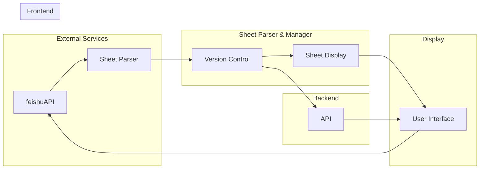

+ [author](http://nsddd.top)

# 第64节 automation: 为飞书文档制作后台

<div><a href = '63.md' style='float:left'>⬆️上一节🔗  </a><a href = '65.md' style='float: right'>  ⬇️下一节🔗</a></div>
<br>

> ❤️💕💕记录[sealos](https://github.com/3293172751/sealos)开源项目的学习过程。[k8s，docker和云原生的学习](https://github.com/3293172751/sealos)。Myblog:[http://nsddd.top](http://nsddd.top/)

---
[TOC]


## 开始

**飞书的文档地址：**

+ https://gu4gn46jrh.feishu.cn/sheets/QHwrsh7nohKptxt9f6fcE0Uqnld

构建一个基于Go语言实现的后台系统，用于管理和展示某ESG标准相关的飞书表格文档中的多个`sheet`。

系统需具有版本管理功能，能跟踪文档各个`sheet`的历史修改记录并支持比较不同版本之间的变化。

系统需要能够识别并解析文档中名为“港交所”的`sheet`，提取其中定义的二级议题和四级议题，并通过`web API`或其他方式将其结构化数据展示给用户。

同时，系统需要具有 `sheet` 识别的通用性，如果文档中新增名为“港交所1”、“港交所2”等的 `sheet`，系统也需要能够识别并进行相同的解析和展示。

**为完成这个需求，需要补充的知识如下:**

1. 精通Go语言，熟悉其Web框架如Gin等以开发 API

2. 熟悉飞书表格文档格式，理解 `sheet`、单元格等结构，能通过飞书开放API解析文档

3. 了解版本控制系统的原理，选择合适的方案实现文档版本管理

4. 具有一定的前端知识，能调用飞书表格API将解析结果在网页端展示

5. 熟练使用Go测试框架并编写测试用例，确保系统关键功能的正确性


## 解决方案

你需要完成一个版本管理的界面，用于管理飞书表格的多个sheet。你需要使用Go语言实现该功能。以下是一些步骤和建议：

1. 首先，你需要了解如何使用Go语言操作Excel表格。你可以使用第三方库，例如 `excelize` 或 `go-xlsx`。

2. 接下来，你需要编写代码来读取飞书表格中的所有`sheet`，并将它们显示在版本管理的界面上。

3. 为了展示“港交所”`sheet`中的二级议题和四级议题，你需要编写代码来解析该`sheet`中的数据，并将其显示在界面上。

4. 如果你在表格上新建了一个 `sheet`，你需要编写代码来识别和显示该`sheet`。

5. 最后，你需要实现版本控制功能，例如保存历史版本、回滚到以前的版本等。

总之，你需要学习如何使用 **Go语言** 操作 **Excel** 表格，并编写代码来解析和显示数据。此外，你还需要学习版本控制的相关知识。


**步骤：**

1. 需要使用飞书开发者平台的表格API，去获取这个表格共享链接对应的sheet列表和`sheet` 内容。

2. `sheet` 内容是JSON格式的，需要解析出里面的二级议题和四级议题，以及它们的名称和内容。

3. 打算做一个后台管理界面，显示这个表格所有的sheet，以及每个sheet的二级议题和四级议题。

4. 需要监听该表格的更新，如果有新建的sheet，能够实时识别和显示出来。

5. 可以使用Go的飞书开发者 SDK 来实现，关键要学习:

- 飞书表格API的使用，获取sheet列表和内容
- JSON 解析，提取我们需要的数据
- Go的web框架，比如Gin来做后台管理界面
- Goroutine和channel来做异步监听表格更新


**大致流程是:**

1. 初始化，使用表格API获取所有的 `sheet` 信息和内容，解析存进数据库

2. 定时去轮询这个表格，如果有更新或者新建的`sheet`，解析其内容存进数据库，更新界面

3. 后台界面从数据库读取数据，展示所有的`sheet`列表，以及每个`sheet`的二级议题和四级议题

4. 如果用户点击某个`sheet`，读取该`sheet`的详细内容展示


## 架构图



**MVC 架构设计：**


**系统的设计思路：**

1. `External Services`: 表示外部依赖的飞书表格服务API。
2. `Sheet Parser & Manager`: 表示解析和管理飞书表格的内部系统。其中Sheet Parser用于解析飞书表格；Version Control 用于提供版本控制功能；Sheet Display用于数据展示。
3. `Display`: 表示数据展示层，包含用于渲染展示 parses 结果的User Interface。
4. `Backend`: 表示内部API服务，Version Control通过API与外界交互。
5. `Frontend`: 表示面向用户的Web页面层。User Interface通过调用Feishu API获取表格数据并将解析结果展示给用户。


## 目录设计

```go
esgtracker/
├── cmd   
│   └── esgtracker     // 项目入口,启动服务 
├── docs               // 文档  
├── internal          
│   ├── model         // 数据模型   
│   │   └── sheet.go
│   │   └── issue.go
│   ├── repository    // 数据访问层 
│   │   └── sheet.go 
│   │   └── issue.go
│   └── service       // 业务逻辑层
│       └── sheet.go
│       └── issue.go
│      
├── pkg              // 第三方依赖 
│   └──  feishu
├── ui                  // 用户界面
│   ├── html_templates
│   └── static
└── cmd/esgtracker/main.go // 服务入口 
```

解释：

- internal包按照域驱动设计切分为model,repository和service三层
- model定义sheet和issue的数据结构
- repository 定义获取和存储 `sheet` 和 `issue` 的接口
- service 包含业务逻辑，调用 repository 存取数据
- ui 目录包含前端静态页面和模板
- pkg 目录管理第三方库依赖，如`feishu SDK`
- cmd 目录下面有服务入口main.go,用于启动服务


## 飞书 API 

通过飞书表格 API，实现文档自动化工作，简单配置就可以生成跨系统的、任意颗粒度的，同时能够直接处理各项信息的工作主页。

利用飞书表格 API，将表单化的数据转换为条目化的测试结果，结合各种质量分析工具进行跨项目、跨测试阶段的问题分析。

::: details 要求
为了使用云文档组件，我们需要保证我们自己的应用拥有 **查看、评论、编辑和管理云文档所有文件** 权限。

:::


### 文档

我们提供了丰富的云文档 API，支持开发者以用户身份调用文档 API，完成创建文档、编辑文档等操作。应用可以通过集成 API，来完成自动化生成报告、批量创建文档等业务场景的文档自动化工作。

+ 创建任务后，调用 [创建文档](https://open.feishu.cn/document/ukTMukTMukTM/ugDM2YjL4AjN24COwYjN) 接口，来创建并初始化文档；

+ 使用 [编辑文档内容](https://open.feishu.cn/document/ukTMukTMukTM/uYDM2YjL2AjN24iNwYjN) 接口，来编辑更新文档内容，包括更新标题、删除范围、插入内容。


> **Note** 图片来自飞书：https://www.feishu.cn/practice_template/86581


### 表格

表格是承载数据的容器，也提供数据处理和呈现的功能。一个表格可能包含一个或者多个工作表，我们在处理数据时，都是针对某个工作表进行操作的。

> 每篇文档都有一个 spreadsheetToken 作为唯一标识，每一个工作表都有一个 sheetId 作为唯一标识。

**spreadsheetToken 以及 sheetId：**

`spreadsheetToken` 是一个表格的唯一标识，你可以通过以下任一方式获取一个表格的 `spreadsheetToken`：

+ 通过表格的 URL 获取：https://sample.feishu.cn/sheets/`shtcnmBA*****yGehy8`
+ 通过 [获取文件夹下文档清单 API](https://open.feishu.cn/document/ukTMukTMukTM/uEjNzUjLxYzM14SM2MTN) 的返回值获取表格的 spreadsheetToken


sheetId 是一个工作表的唯一标识，你可以通过以下任一方式获取一个工作表的 sheetId：

+ 通过表格的 URL 获取：https://sample.feishu.cn/sheets/`shtcnmBA*****yGehy8?sheet=0b**12`
+ 通过 [获取表格元数据 API](https://open.feishu.cn/document/ukTMukTMukTM/uETMzUjLxEzM14SMxMTN) 的返回值获取工作表的 sheetId

> 几乎所有的表格操作方法，需要传入 spreadsheetToken 来指定要操作的表格。


**Range:**

Range 描述工作表的某个范围。在数据读写中，能帮助用户过滤数据的操作范围。

range 的描述方式为 `<sheetId>!<开始位置>:<结束位置>` ，共有 4 种描述方法，分别为：

+ `<sheetId>!<开始单元格>:<结束单元格>`
  如：`0b**12!A1:B5` 就表示 `0b**12` 这个工作表中 `A1:B5` 的区域，如下图所示：


+ `<sheetId>!<开始列>:<结束列>`，如：`0b**12!A:B`
+ `<sheetId>!<开始单元格>:<结束列>`，如：`0b**12!A1:B`
+ `<sheetId>`，区域留空，如：`0b**12`，代表这个表格中非空的最大行列范围内的数据


### 接入指南

我觉得多维表格的功能并不简简单单的是多维表格，多维表格（Base）是飞书云文档下的一个产品。它可以是一个表格，也可以是无数个应用。

**形态：**

一篇多维表格可以理解成是一个应用（app），标记该应用的唯一标识叫 `app_token`；

每篇多维表格是由多个数据表（table）组成的，标记该数据表的唯一标识叫 `table_id`；

| 飞书云文档中                         | 飞书文档中                                         | 飞书表格中                         |
| ------------------------------------ | -------------------------------------------------- | ---------------------------------- |
| Base app                             | Base doc block                                     | Base sheet block                   |
| 即在"**飞书云文档**"中新建的多维表格 | 即在"**飞书文档**"中插入的多维表格                 | 即在"**飞书表格**"中新建的多维表格 |
| URL 以 **feishu.cn/base** 开头       | URL 以 **feishu.cn/docs**、**feishu.cn/docx** 开头 | URL 以 **feishu.cn/sheets** 开头   |
| 支持                                 | 支持                                               | 支持                               |


### 飞书创建 robot 的步骤

1. 在租户下[新建【企业自建应用】](https://open.feishu.cn/document/home/introduction-to-custom-app-development/self-built-application-development-process)；
2. 申请应用接口调用权限: 根据需要调用的接口文档中描述的「权限要求」到开发者后台申请应用权限；
3. 发布应用，租户管理员通过审核；
4. [添加应用为文档协作者](https://open.feishu.cn/document/ukTMukTMukTM/uczNzUjL3czM14yN3MTN#2431c595)，需要 文档所有者、知识库管理员 或 其他协作者 为资源 添加文档应用。文档、电子表格、多维表格、知识库 通过云文档 Web 页面右上方「...」->「...更多」-> 「添加文档应用」入口添加。


##  目录说明

```bash
.
├── CONTRIBUTING.md                # 贡献指南
├── LICENSE                        # 许可证
├── Makefile                       # Makefile文件
├── README.md                      # 项目说明
├── cmd                            # 命令行应用程序
├── configs                        # 配置文件
│   └── config.yaml                # 配置文件
├── docs                           # 文档
│   └── README.md                  # 文档说明
├── examples                       # 示例代码
├── go.mod                         # Go模块文件
├── internal                       # 内部包
│   ├── controllers                # 控制器
│   │   └── sheet.go               # 表格控制器
│   ├── model                      # 模型
│   │   └── sheet.go               # 表格模型
│   ├── service                    # 服务
│   │   └── sheet.go               # 表格服务
│   ├── utils                      # 工具函数
│   │   └── utils.go               # 工具函数
│   └── views                      # 视图
│       ├── disclosures            # 披露视图
│       └── metrics                # 指标视图
├── pkg                            # 包
│   ├── feishu                     # 飞书相关的包
│   │   ├── auth                   # 鉴权相关
│   │   │   └── auth.go            # 鉴权包
│   │   ├── chat                   # 聊天相关
│   │   │   ├── chat.go            # 聊天包
│   │   │   └── message.go         # 消息包
│   │   └── drive                  # 云文档相关
│   │       └── drive.go           # 云文档包
│   ├── http                       # HTTP相关的包
│   ├── logging                    # 日志相关的包
│   └── version                    # 版本相关的包
│       └── version.go             # 版本包
├── scripts                        # 脚本
│   ├── boilerplate.txt            # 代码模板
│   └── githooks                   # Git钩子
│       ├── commit-msg             # 提交信息钩子
│       ├── pre-commit             # 提交前钩子
│       └── pre-push               # 推送前钩子
├── test                           # 测试代码
│   └── README.md                  # 测试说明
└── web                            # Web应用程序
```


## 表设计

设计方案：

```go
CREATE TABLE `sheet` (
  `id` int(11) NOT NULL AUTO_INCREMENT,
  `name` varchar(50) NOT NULL COMMENT '表名称',
  `type` enum('GRI','社科院','港交所','SASB') NOT NULL COMMENT '表类型',
  PRIMARY KEY (`id`)
) ENGINE=InnoDB DEFAULT CHARSET=utf8;
```

gri 表：

```sql
CREATE TABLE `gri` (
  `id` int(11) NOT NULL AUTO_INCREMENT,
  `first_dimension` varchar(255) NOT NULL COMMENT '一级维度',
  `second_issue` varchar(255) NOT NULL COMMENT '二级议题',
  `third_index` varchar(255) NOT NULL COMMENT '三级指标',
  `fourth_question` varchar(255) DEFAULT NULL COMMENT '四级问题',
  PRIMARY KEY (`id`)
) ENGINE=InnoDB DEFAULT CHARSET=utf8mb4 COMMENT='GRI表';
```

社科院表：

```sql
CREATE TABLE `social_science_academy` (
  `id` int(11) NOT NULL AUTO_INCREMENT,
  `first_dimension` varchar(255) NOT NULL COMMENT '一级维度',
  `second_issue` varchar(255) NOT NULL COMMENT '二级议题',
  `third_index` varchar(255) NOT NULL COMMENT '三级指标',
  `fourth_question` varchar(255) DEFAULT NULL COMMENT '四级问题',
  PRIMARY KEY (`id`)
) ENGINE=InnoDB DEFAULT CHARSET=utf8mb4 COMMENT='社科院表';
```

港交所表：

```sql
CREATE TABLE `hkex` (
  `id` int(11) NOT NULL AUTO_INCREMENT,
  `first_dimension` varchar(255) NOT NULL COMMENT '一级维度',
  `second_issue` varchar(255) NOT NULL COMMENT '二级议题',
  `third_index` varchar(1023) NOT NULL COMMENT '三级指标',
  `fourth_question` varchar(1023) DEFAULT NULL COMMENT '四级问题',
  PRIMARY KEY (`id`)
) ENGINE=InnoDB DEFAULT CHARSET=utf8mb4 COMMENT='港交所表';
```

sasb 表：

```sql
CREATE TABLE `sasb` (
  `id` int(11) NOT NULL AUTO_INCREMENT,
  `first_dimension` varchar(255) NOT NULL COMMENT '一级维度',
  `second_issue` varchar(255) DEFAULT NULL COMMENT '二级议题',
  `third_index` varchar(255) DEFAULT NULL COMMENT '三级指标',
  `fourth_question` varchar(255) DEFAULT NULL COMMENT '四级问题',
  PRIMARY KEY (`id`)
) ENGINE=InnoDB DEFAULT CHARSET=utf8mb4 COMMENT='SASB表';
```


## END 链接

### 开源社的一些链接 

+ https://kaiyuanshe.cn/department
+ https://github.com/kaiyuanshe


### 导航

<ul><li><div><a href = '63.md' style='float:left'>⬆️上一节🔗  </a><a href = '65.md' style='float: right'>  ️下一节🔗</a></div></li></ul>

+ [Ⓜ️回到目录🏠](../README.md)

+ [**🫵参与贡献💞❤️‍🔥💖**](https://nsddd.top/archives/contributors))

+ ✴️版权声明 &copy; ：本书所有内容遵循[CC-BY-SA 3.0协议（署名-相同方式共享）&copy;](http://zh.wikipedia.org/wiki/Wikipedia:CC-by-sa-3.0协议文本) 

